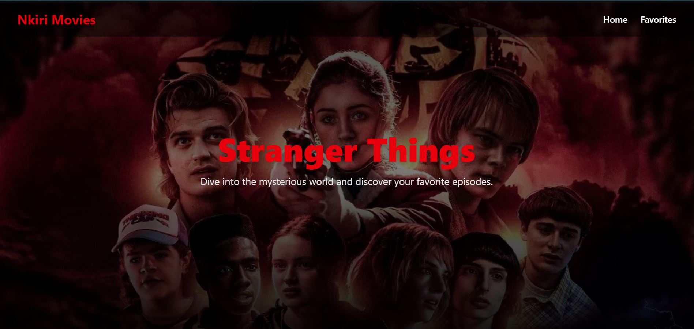
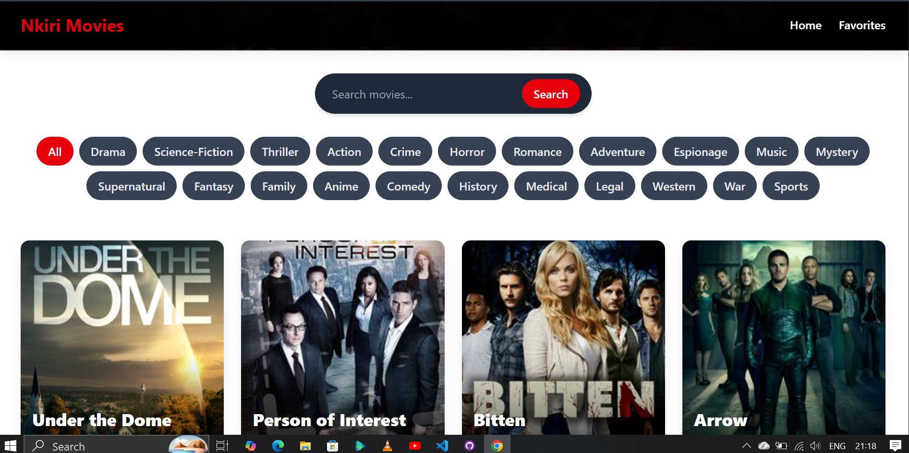
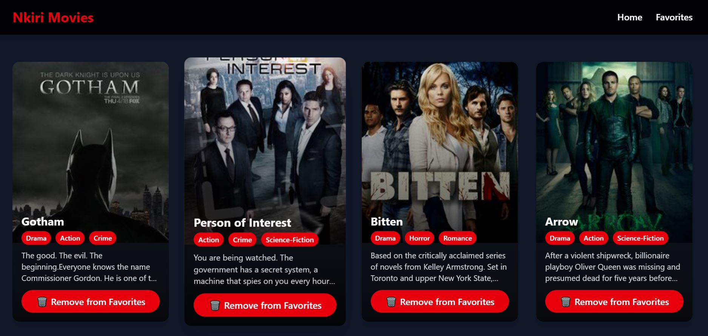
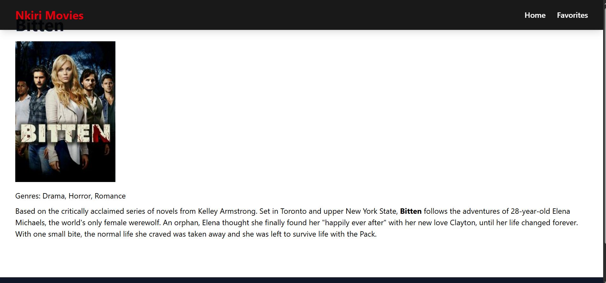

# React Movie Explorer 

A modern and responsive React application for browsing, searching, and saving your favorite movies. Explore trending shows, filter by category, and manage your favorites in a clean interface.

## Features

- Browse a large collection of movies and TV shows
- Search movies by name
- Filter movies by category/genre
- Add and remove movies from favorites (stored in localStorage)
- Responsive design for mobile and desktop
- Smooth hover animations and transitions
- Clean UI with hero section, movie grids, and footer

## Technologies

- **React** – Frontend library for building user interfaces
- **React Router DOM** – Client-side routing
- **Tailwind CSS** – Styling and responsive design
- **TVMaze API** – Fetch movies and TV shows
- **LocalStorage** – Persistent storage for favorites

## Installation

1. **Clone the repository:**

**bash or in terminal**
git clone https://github.com/Isingizwe12/React-Movie-Explorer.git

2. **Navigate to the project directory:**
cd React-Movie-Explorer

3. **Install dependencies:**
npm install

4. **Start the development server:**

Live Demo

Check out the live demo here:

https://movie-explorer-isingizwe.netlify.app/

### Home Page

### Favorites Page

### Movie Details
